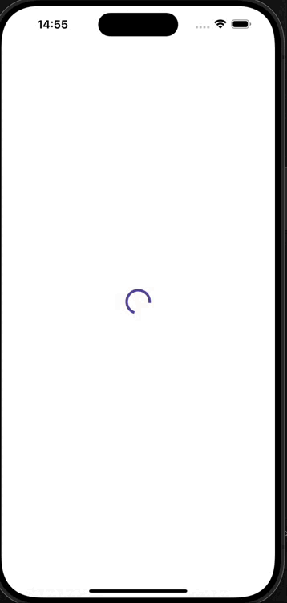

# Pokédex Flutter App

Um app Flutter que consome a [PokéAPI](https://pokeapi.co/) e mostra informações sobre os Pokémon.  
Inspirado no clássico **“Quem é esse Pokémon?”**, com animações, telas de detalhes e lista de criaturas.

## 🎥 Demonstração

  

---

## ✨ Funcionalidades

- **Splash Screen animada**  
  - Exibe um Pokémon aleatório.  
  - Animação de revelação ("Quem é esse Pokémon?").  
  - Retry em caso de erro.  

- **Lista de Pokémon**  
  - Paginação (carregamento incremental).  
  - Exibe nome, thumbnail e artwork.  

- **Detalhes do Pokémon**  
  - Mostra altura, peso, tipos e habilidades.  
  - Suporte a múltiplos idiomas via `flutter_localizations` + ARB.  

- **Arquitetura limpa**  
  - **Domain**: entidades e casos de uso.  
  - **Data**: DTOs, serviços e repositórios.  
  - **Presentation**: Stores com **MobX** e telas em Flutter.  

---

## 🛠️ Stack

- [Flutter](https://flutter.dev/) (Material 3)  
- [Dio](https://pub.dev/packages/dio) para HTTP  
- [MobX](https://pub.dev/packages/mobx) para gerenciamento de estado  
- [Cached Network Image](https://pub.dev/packages/cached_network_image) para cache de imagens  
- [Flutter Gen](https://pub.dev/packages/flutter_gen) para geração de localizações e assets  
- Testes com [flutter_test](https://api.flutter.dev/flutter/flutter_test/flutter_test-library.html) + [mocktail](https://pub.dev/packages/mocktail)  

---

## 🚀 Como rodar o projeto

### 1. Clonar o repositório
git clone https://github.com/seu-usuario/pokemon_app.git
cd pokemon_app

### 🔧 Pré-requisitos
- [Flutter](https://flutter.dev/docs/get-started/install) (versão 3.22.0 ou superior)
- [Dart SDK](https://dart.dev/get-dart) (compatível com sua versão do Flutter)
- Conexão com a internet (a aplicação consome a [PokeAPI](https://pokeapi.co/))

### 📥 Instalar dependências
Execute o comando na raiz do projeto:

flutter pub get

